# SentinelAD - Khai Technology Enterprise Portal & Infrastructure Monitoring

Dự án xây dựng **Cổng thông tin nội bộ (Intranet Portal)** cho công ty công nghệ Khai Technology kết hợp **Quản trị định danh tập trung qua Active Directory (Windows Server 2022)** và **Hệ thống giám sát an toàn hạ tầng (Prometheus, Grafana, Loki, AI Log Analyzer, Telegram Alerts)**.

---

## 📸 Hình ảnh minh chứng hoàn thành thực tế (Evidence Screenshots)

### I. Cổng thông tin nội bộ (Web Portal)

#### 1. Trang chủ Cổng thông tin (Dashboard)
Trang tổng quan với banner chào mừng nhân viên, lịch họp sắp tới trong ngày, feed tin tức công ty, danh sách nhân sự mới và biểu đồ phân bổ tài sản CNTT.
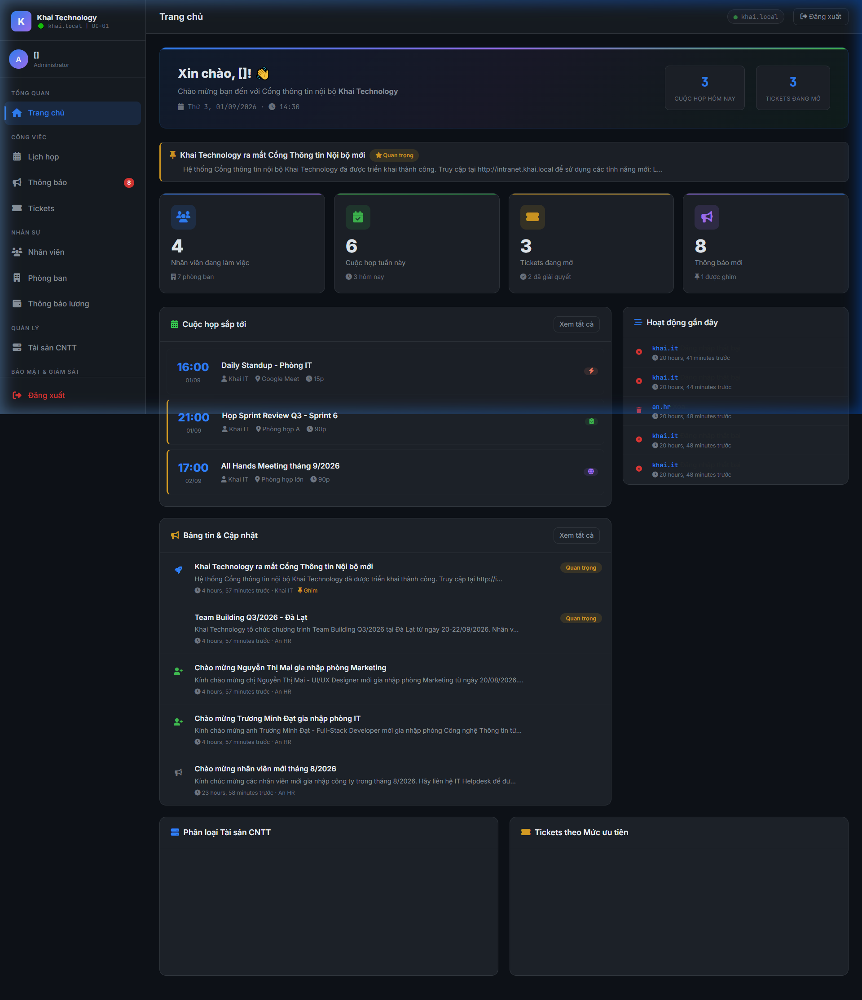

#### 2. Quản lý Lịch họp & Điểm danh RSVP (`/meetings/`)
Hỗ trợ tạo lịch họp theo phòng ban, lọc theo ngày/tuần, đặt địa điểm (Google Meet, Zoom, Phòng họp) và cho phép nhân viên bấm xác nhận tham dự (RSVP).
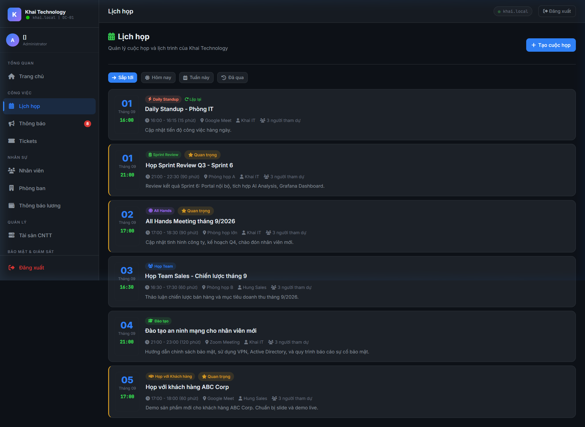

#### 3. Thông báo lương bảo mật (`/payroll/`)
Phân quyền bảo mật: nhân viên chỉ xem được phiếu lương của chính mình, chỉ Admin/HR mới có quyền tạo và quản lý bảng lương toàn công ty.
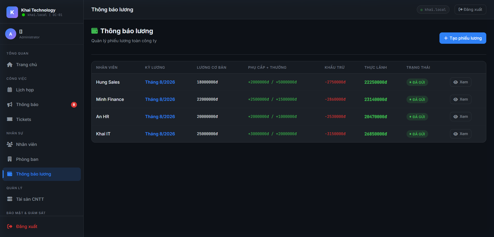

#### 4. Bảng tin nội bộ & Chào đón nhân sự mới (`/announcements/`)
Đăng tải tin tức công ty, chính sách, sự kiện team building và bài viết chào mừng nhân viên mới gia nhập với tính năng ghim bài quan trọng.
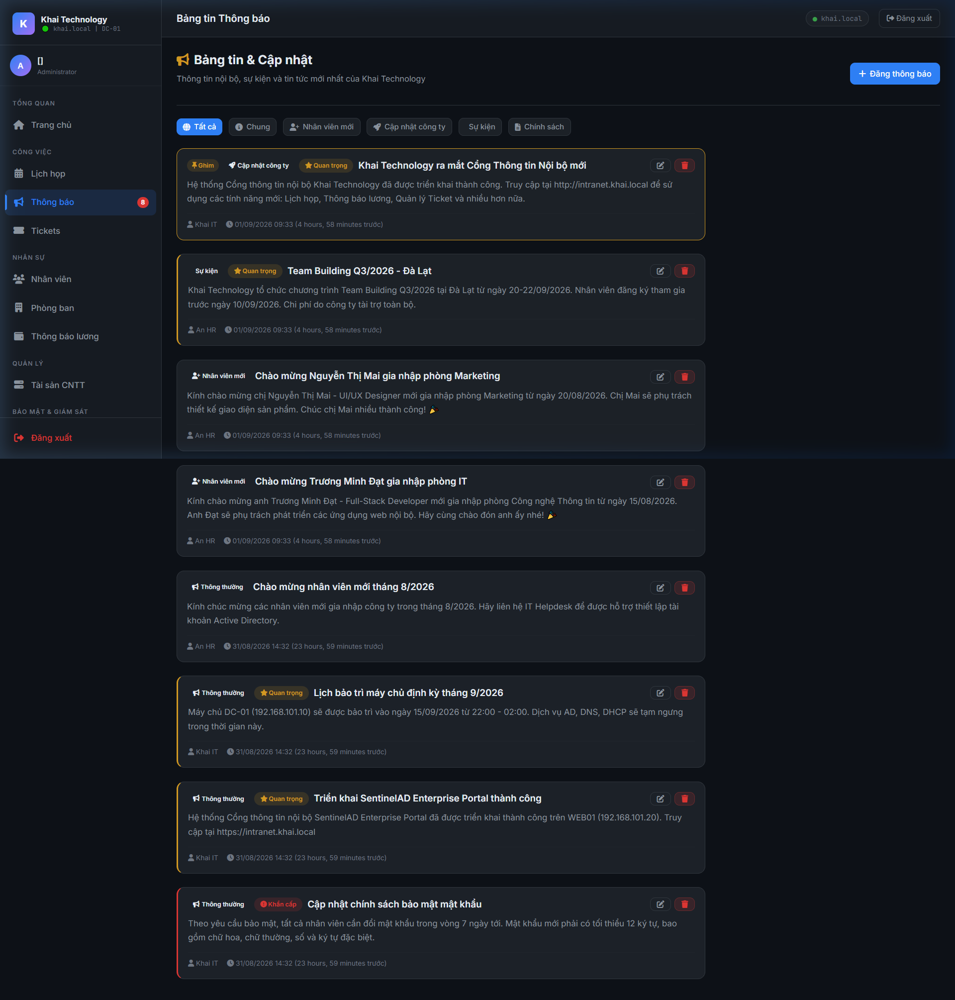

#### 5. Danh mục Nhân viên đồng bộ trực tiếp từ Active Directory (`/employees/`)
Dữ liệu nhân sự được đồng bộ 2 chiều trực tiếp từ máy chủ Domain Controller (`DC-01: 192.168.101.10`) qua giao thức LDAP. Có nút bấm "Đồng bộ từ DC-01" 1-click.
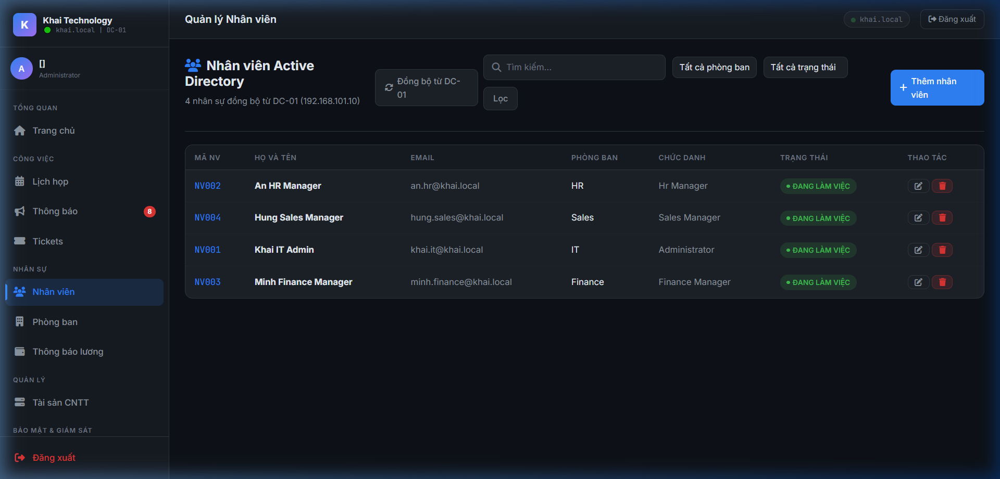

---

### II. Hạ tầng Máy chủ Windows Server 2022 (`DC-01`: `192.168.101.10`)

#### 1. Active Directory Users and Computers (Cấu trúc OU & Tài khoản)
Cấu trúc tổ chức `OU=Company` phân chia theo phòng ban (`IT`, `HR`, `Finance`, `Sales`, `Marketing`, `Telesale`, `Servers`, `Workstations`), tạo nhóm bảo mật `IT_Admin`, `Helpdesk` và tài khoản người dùng `Khai IT Admin`.
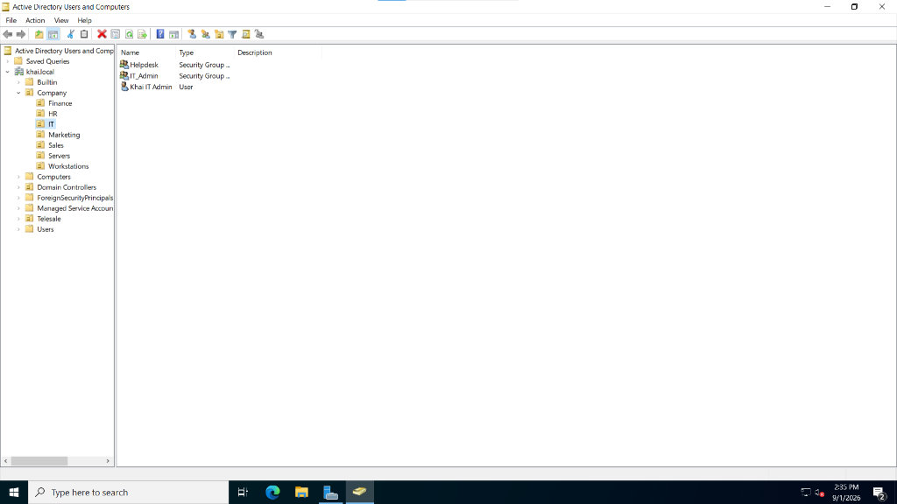

#### 2. DNS Server (`khai.local`)
Khai báo đầy đủ các bản ghi Host (A) phân giải tên miền nội bộ: `dc-01` (`192.168.101.10`), `intranet` (`192.168.101.7`), `grafana` (`192.168.101.30`), `ai` (`192.168.101.40`), `web01` (`192.168.101.20`).
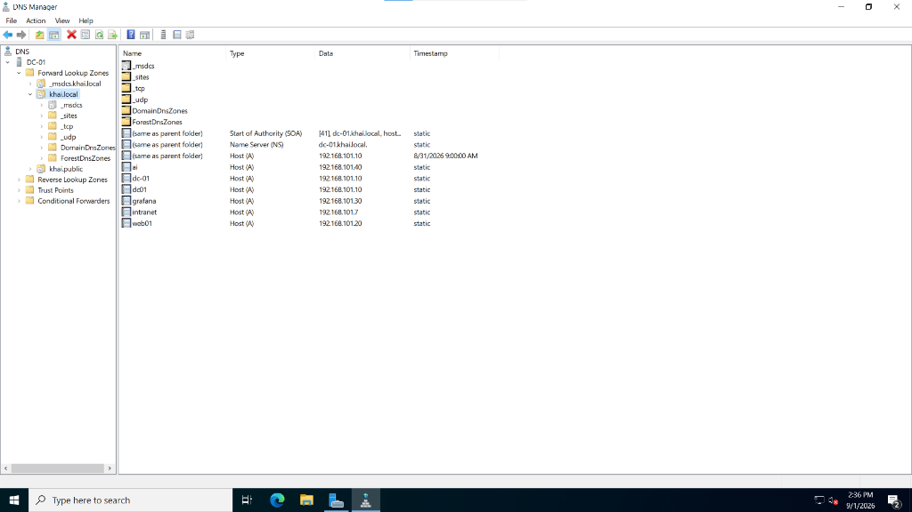

#### 3. DHCP Server (`Scope 192.168.101.0 khai_LAN`)
Cấu hình Scope Options cấp phát mạng tự động: `Option 003 Router` (`192.168.101.10`), `Option 006 DNS Servers` (`192.168.101.10`), `Option 015 DNS Domain Name` (`khai.local`) cho toàn bộ thiết bị và điện thoại nhân viên khi vào Wi-Fi.
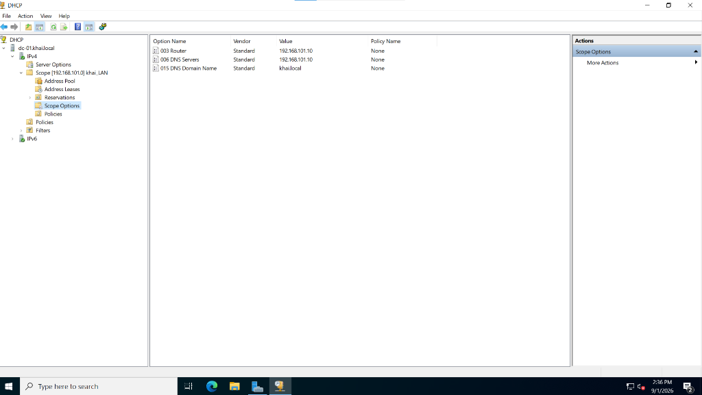

#### 4. Routing and Remote Access (Hạ tầng VPN Server)
Kích hoạt thành công dịch vụ VPN trên máy chủ `DC-01 (local)` với đầy đủ các cổng bảo mật: `WAN Miniport (IKEv2)`, `WAN Miniport (L2TP)`, `WAN Miniport (SSTP)` và `WAN Miniport (PPTP)` sẵn sàng nhận kết nối an toàn từ xa.
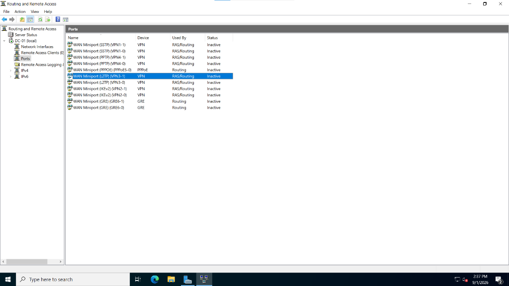

#### 5. Group Policy: Chính sách Mật khẩu (Password Policy)
Thiết lập chính sách bảo mật toàn miền: Độ dài mật khẩu tối thiểu 12 ký tự (Minimum password length), Bắt buộc độ phức tạp (Password complexity Enabled), Thời hạn tối đa 90 ngày (Maximum password age).
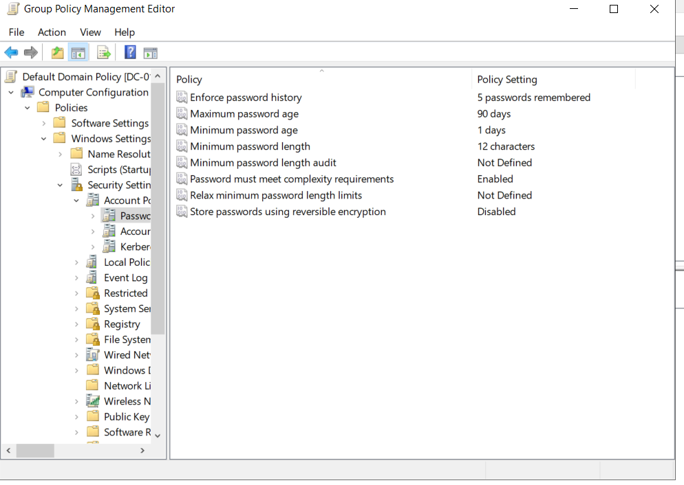

#### 6. Group Policy: Chính sách Khóa tài khoản (Account Lockout Policy)
Thiết lập quy định phòng chống tấn công dò quét mật khẩu (Brute-force): Tự động khóa tài khoản sau 5 lần nhập sai liên tiếp (Account lockout threshold: 5 invalid logon attempts) trong 30 phút.
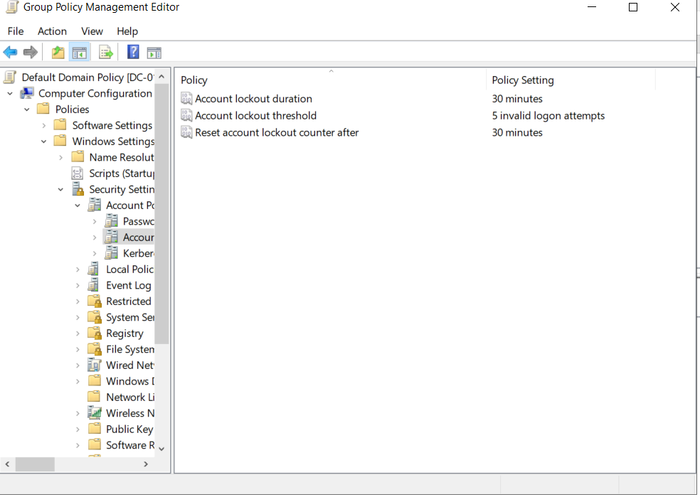

#### 7. Event Viewer: Nhật ký Sự kiện An ninh (Security Audit Logs)
Máy chủ ghi nhận đầy đủ các sự kiện an ninh quan trọng: Event 4624 (Logon thành công qua LDAP), Event 4634 (Logoff), Event 4672 (Đặc quyền Administrator) làm nguồn dữ liệu cho AI Analyzer và Grafana/Loki.
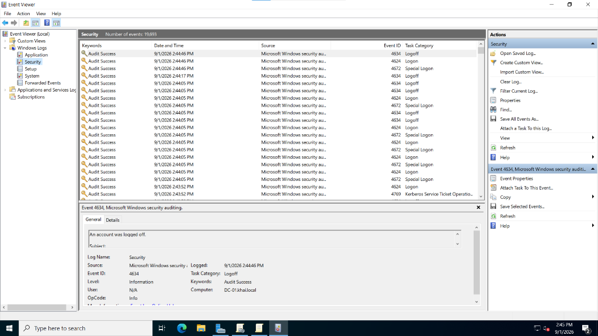

---

### III. Cụm Giám sát Hạ tầng & An ninh (Grafana Dashboards)

#### 1. SentinelAD - Security Overview Dashboard
Giám sát tổng quan sự kiện an ninh mạng, tỷ lệ đăng nhập thành công vs thất bại (`Failed Events: 81`), trạng thái các dịch vụ Active Directory then chốt (DHCP, DNS, KDC, Netlogon, NTDS) và luồng Live Audit Log Stream theo thời gian thực.
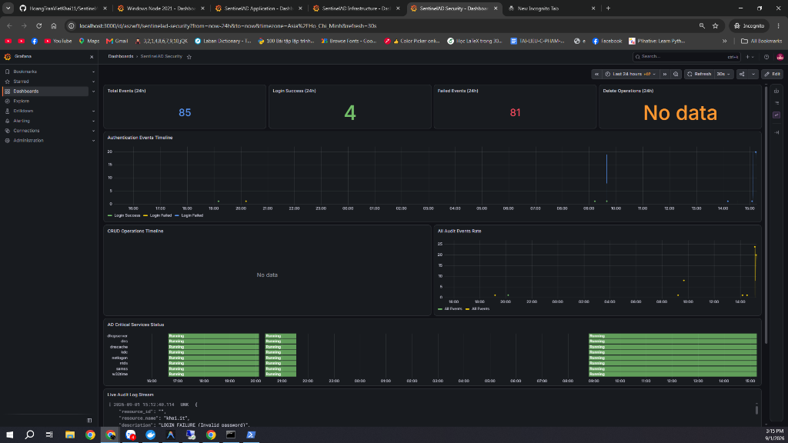

#### 2. SentinelAD - Infrastructure Monitoring Dashboard
Theo dõi chỉ số phần cứng máy chủ toàn diện: Thời gian hoạt động (System Uptime: 1.2 ngày), Mức sử dụng RAM (Memory Usage: 67.2%), Dung lượng ổ đĩa (Disk Usage: 2.93%) và biến động lưu lượng mạng (Network Traffic).
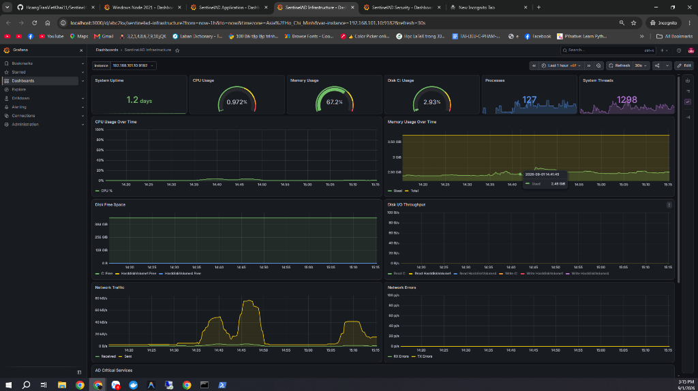

#### 3. SentinelAD - Application Metrics Dashboard
Thống kê hoạt động của Cổng thông tin nội bộ: Tổng số lượt truy cập (Total Audit Events: 85), Số lượng người dùng hoạt động (Active Users: 4) và luồng log ứng dụng chi tiết.
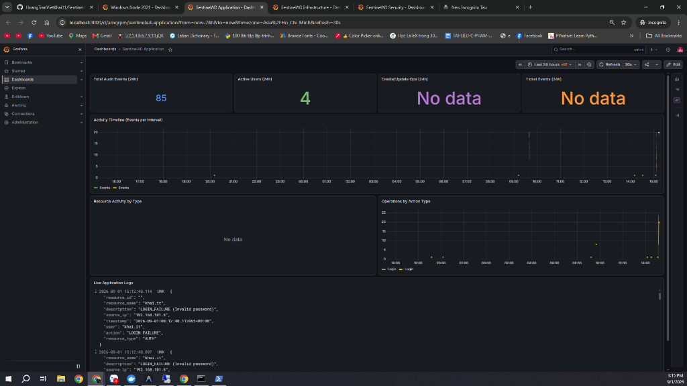

#### 4. Windows Node 2021 Dashboard (Hạ tầng Máy chủ Windows)
Giám sát chi tiết hiệu năng của máy chủ Windows Server 2022 qua Windows Exporter: Tải CPU load, mức chiếm dụng bộ nhớ RAM, tốc độ đọc/ghi ổ cứng và lưu lượng mạng card mạng.
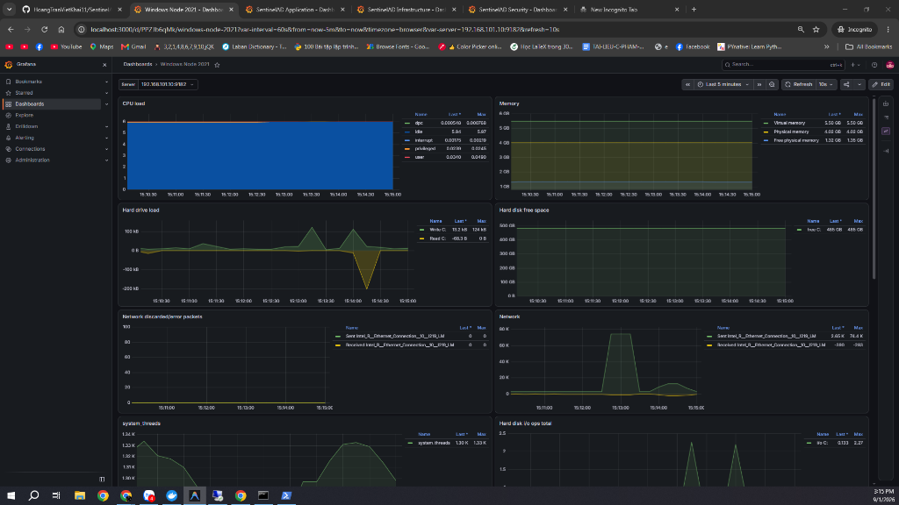

#### 5. Windows Services & System Threads Dashboard
Theo dõi trạng thái các dịch vụ lõi Windows Service (Active, Boot, Disabled, Manual), số lượng System Threads và System Context Switches.
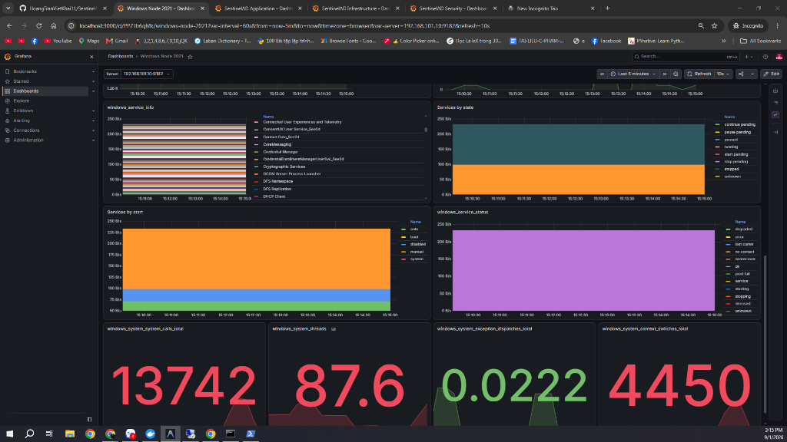

---

### IV. Diễn tập An ninh Mạng (Red Team vs Blue Team Testing)

Mô hình diễn tập thực tế được thực hiện từ máy **Linux (Attacker - IP: 192.168.101.6)** nhắm vào **Web Portal (192.168.101.7)** và **Domain Controller (192.168.101.10)**:

#### 1. Kiểm thử Bắn tải lưu lượng (HTTP Flood / DoS & Disk I/O Stress Test)
* **Công cụ:** `ApacheBench (ab)`
* **Lệnh thực thi:**
  ```bash
  ab -n 3000 -c 30 http://192.168.101.7/static/css/sentinel.css
  ```
* **Kết quả:** Hoàn thành 3.000 requests trong **7.94 giây** (tốc độ **377.64 req/sec**, truyền tải **80.1 MB dữ liệu** với băng thông đạt **9.85 MB/s**, 0 lỗi), biểu đồ mạng và Disk I/O trên Grafana phản hồi tăng vọt tức thì.

#### 2. Kiểm thử Dò bẻ khóa Mật khẩu (Brute-Force Attack)
* **Công cụ:** `THC-Hydra`
* **Lệnh thực thi:**
  ```bash
  hydra -l khai.it -P pass.txt 192.168.101.7 http-post-form "/auth/login/:username=^USER^&password=^PASS^:Tên đăng nhập hoặc mật khẩu không đúng" -V
  ```
* **Kết quả:** Web Portal ghi nhận liên tiếp 5 sự kiện `LOGIN_FAILURE`, hệ thống kích hoạt gửi cảnh báo đỏ tức thời qua Telegram Bot.

#### 3. Mô phỏng Tấn công Phân tán từ Mạng Botnet (Multi-IP Botnet Attack)
* **Công cụ:** `multi_ip_attack.py`
* **Lệnh thực thi:**
  ```bash
  python3 multi_ip_attack.py
  ```
* **Kết quả:** Gửi 15 đợt tấn công từ 15 địa chỉ IP quốc tế khác nhau (Mỹ, Nga, Singapore, Đức, Việt Nam), hệ thống **AI Security Analyzer** phát hiện và phân tích hành vi xâm nhập dạng *Distributed Credential Stuffing*.

#### 4. Quét cổng & Dò tìm đường dẫn nhạy cảm
* **Công cụ:** `Nmap` & `FFUF`
* **Lệnh thực thi:**
  ```bash
  nmap -sV -p 80,3000,9090,389,53 192.168.101.7
  ffuf -w wordlist.txt -u http://192.168.101.7/FUZZ -mc 200,301,403,404
  ```
* **Kết quả:** Xác định chính xác các dịch vụ đang mở và các phản hồi HTTP status code.

#### 5. Kiểm thử Tấn công Giữ kết nối Cạn kiệt Tài nguyên (Slowloris Attack)
* **Công cụ:** `SlowHTTPTest`
* **Lệnh thực thi:**
  ```bash
  slowhttptest -c 200 -H -g -o slowloris -i 10 -r 200 -t GET -u http://192.168.101.7/ -l 60
  ```
* **Kết quả:** Duy trì thành công 200 kết nối chậm liên tục trong 60 giây, kiểm tra độ ổn định của Web Server và khả năng phát hiện luồng kết nối bất thường trên hệ thống giám sát.

---

## 🏗️ Sơ đồ kiến trúc & Luồng hoạt động

```
[ Điện thoại / Laptop nhân viên ]
       │
       ├── (Trong cty): Wi-Fi / LAN nội bộ (DNS -> 192.168.101.10)
       └── (Từ xa):     Remote Access VPN (IKEv2 / IPsec)
       │
       ▼
[ Web Server Django - http://intranet.khai.local ] (192.168.101.7)
       │
       ├── 1. Xác thực người dùng (Live LDAP Port 389) ──────┐
       ├── 2. Tự động tạo OU & User trên AD khi thêm mới ────┤
       ├── 3. Giám sát & Quét log sự kiện (Event Logs) ──────┤
       │                                                     ▼
       │                                      [ Windows Server 2022 DC-01 ]
       │                                             (192.168.101.10)
       │                                      - Active Directory (khai.local)
       │                                      - DNS Server & DHCP Server
       │                                      - Routing & Remote Access (VPN)
       │                                      - Group Policy Objects (GPO)
       │
       ├── 4. Phân tích an ninh (AI Analyzer - Llama 3.1 qua Groq API)
       ├── 5. Cảnh báo xâm nhập thời gian thực qua Telegram Bot
       └── 6. Đẩy Metrics & Logs vào Docker Stack (Prometheus + Loki + Grafana)
```

---

## ⚙️ Các tính năng đã hoàn thiện

### 1. Cổng thông tin nội bộ (Khai Technology Portal)
* **Trang chủ (Dashboard):** Giao diện Dark-mode hiện đại, hiển thị lời chào theo tài khoản, đếm số cuộc họp hôm nay, thông báo lương chưa xem, feed tin tức.
* **Lịch họp (Meetings):** Tạo lịch họp Standup, Họp Team, Review, All Hands; hỗ trợ RSVP cho người tham gia.
* **Thông báo (Announcements):** Phân loại danh mục (Nhân viên mới, Cập nhật công ty, Sự kiện, Chính sách); hỗ trợ ghim bài lên đầu.
* **Bảng lương (Payroll):** Xem chi tiết phiếu lương cá nhân, tính toán tự động lương thực lãnh, bảo mật phân quyền nghiêm ngặt.
* **Yêu cầu hỗ trợ (IT Helpdesk Tickets):** Gửi yêu cầu hỗ trợ kỹ thuật nội bộ, phân loại theo mức độ ưu tiên.
* **Quản lý thiết bị (IT Assets):** Quản lý máy chủ, laptop, switch, firewall, theo dõi thời hạn bảo hành.

### 2. Tích hợp Active Directory (DC-01 `khai.local`)
* **Xác thực Live LDAP:** Đăng nhập trực tiếp bằng tài khoản Active Directory thật (hỗ trợ định dạng `username`, `khai\username`, `username@khai.local`).
* **Đồng bộ 2 chiều (Two-Way Sync):** Thao tác thêm/sửa/xóa nhân viên trên Web sẽ tự động gọi LDAP tạo/vô hiệu hóa User và OU tương ứng trên Windows Server 2022.
* **Lệnh đồng bộ 1-click:** Lệnh `python manage.py sync_ad` hoặc bấm nút trên web để kéo toàn bộ User/OU từ DC-01 về web trong vài giây.
* **Phân quyền vai trò (RBAC Mapping):**
  * `Domain Admins` / `IT_Admin` → Quản trị viên (Toàn quyền).
  * `HR_Manager` → Trưởng phòng nhân sự (Quản lý nhân viên, tạo phiếu lương).
  * `Finance_Manager` → Quản lý tài chính.
  * `Sales_Manager` → Quản lý kinh doanh.
  * `Department_User` → Nhân viên tiêu chuẩn.

### 3. Giám sát an toàn hạ tầng & Cảnh báo
* **Audit Logging:** Ghi nhận toàn bộ sự kiện đăng nhập thành công/thất bại, IP truy cập và lịch sử chỉnh sửa dữ liệu.
* **AI Security Analyzer:** Kết nối mô hình Llama 3.1 để đọc log đăng nhập, phát hiện hành vi dò quét mật khẩu (Event 4625 / Brute-force).
* **Telegram Bot Alerts & Control Center:** Tự động gửi thông báo khẩn cấp về điện thoại của Quản trị viên và nhận lệnh khóa tài khoản từ xa qua Telegram.
* **Cụm Docker Observability:**
  * **Prometheus:** Thu thập metrics tài nguyên máy chủ qua Windows Exporter.
  * **Grafana:** 4 Dashboards trực quan hóa giám sát CPU, RAM, Disk, Network, Security.
  * **Loki & Promtail:** Thu thập và tìm kiếm log tập trung.
* **Remote Access VPN:** Cấu hình VPN Server (IKEv2 / IPsec) trên Windows Server 2022 để quản trị viên kết nối an toàn từ xa khi đi công tác.

---

## 🚀 Hướng dẫn cài đặt & Chạy dự án

### 1. Chuẩn bị môi trường
* Python 3.10 trở lên
* Docker & Docker Compose (nếu chạy cụm giám sát)
* Máy chủ Windows Server 2022 đã cấu hình AD DS (`khai.local`)

### 2. Cài đặt Web Portal
```bash
# 1. Clone repository
git clone https://github.com/HoangTranVietKhai11/SentinelAD---Khai-Technology-Intelligent-Enterprise-Portal.git
cd "SentinelAD---Khai-Technology-Intelligent-Enterprise-Portal"

# 2. Cài đặt thư viện
cd sentinelad_portal
pip install -r requirements.txt

# 3. Tạo file cấu hình môi trường .env (dựa theo .env.example)
cp ../.env.example .env

# 4. Chạy migration
python manage.py migrate

# 5. Đồng bộ dữ liệu thực tế từ Active Directory DC-01
python manage.py sync_ad

# 6. Khởi động Web Server
python manage.py runserver 0.0.0.0:80
```

### 3. Khởi động Cụm Giám sát (Monitoring)
```bash
cd ../monitoring
docker compose up -d
```

### 4. Địa chỉ truy cập
* **Web Portal nội bộ:** `http://intranet.khai.local` (hoặc `http://localhost`)
* **Grafana Observability:** `http://localhost:3000` (User: `admin` / Pass: `admin`)
* **Prometheus Metrics:** `http://localhost:9090`

---

## 👤 Thông tin tác giả

* **Họ và tên:** Hoàng Trần Việt Khải
* **Dự án:** SentinelAD - Khai Technology Enterprise Portal
* **Domain nội bộ:** `khai.local` · Máy chủ: `DC-01 (192.168.101.10)`
