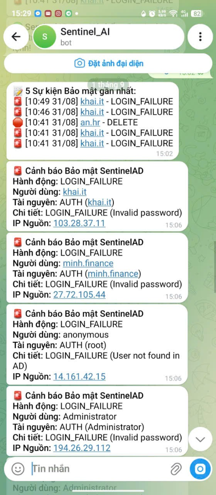
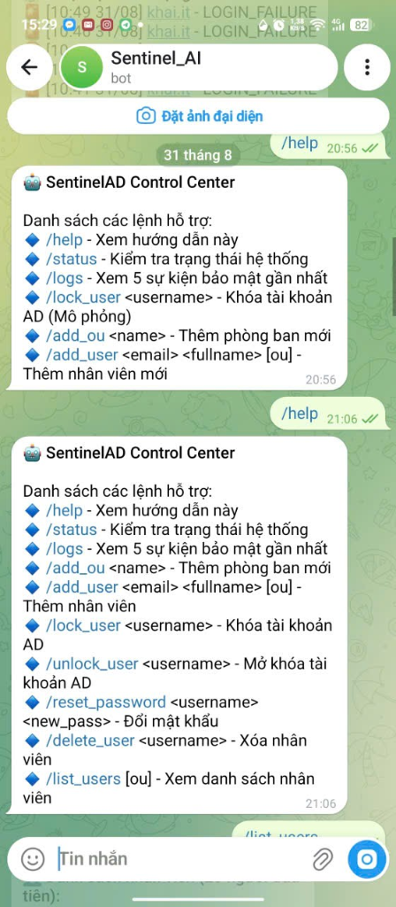
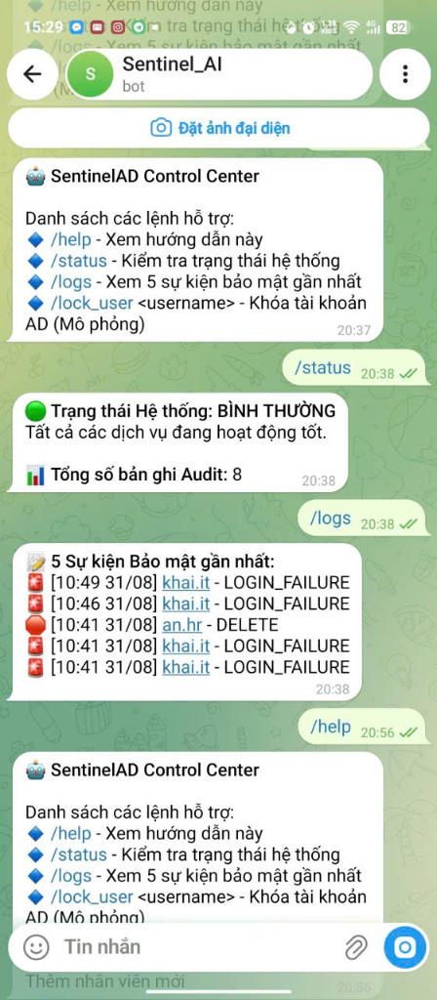
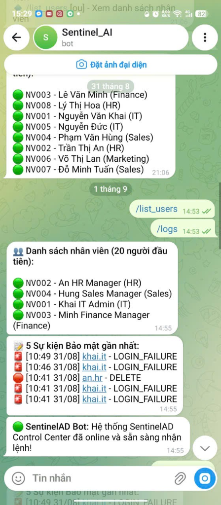

# SentinelAD - Khai Technology Enterprise Portal & Infrastructure Observability

<p align="left">
  
  
  
  
  
  
  
  
  
  
  
  
</p>

Hệ thống Cổng thông tin nội bộ (Enterprise Intranet Portal) tích hợp quản trị định danh người dùng tập trung qua Active Directory (Windows Server 2022) và cụm giám sát an toàn hạ tầng theo thời gian thực (Prometheus, Grafana, Loki, AI Log Analyzer, Telegram Notification Service).

---

## 1. Kiến trúc Hệ thống & Luồng Dữ liệu

```
[ Client / Endpoint ]
  │
  ├── Mạng nội bộ (LAN / Wi-Fi) ──> DNS Server (192.168.101.10)
  └── Kết nối từ xa (Remote)   ──> RRAS VPN Server (IKEv2 / IPsec)
  │
  ▼
[ Web Application Server - Django ] (192.168.101.7:80)
  │
  ├── 1. Xác thực người dùng qua LDAP Simple Bind (Port 389) ──┐
  ├── 2. Quản lý vòng đời tài khoản & đồng bộ OU 2 chiều ──────┤
  ├── 3. Giám sát & thu thập Security Event Logs ─────────────┤
  │                                                            ▼
  │                                            [ Windows Server 2022 DC-01 ]
  │                                                   (192.168.101.10)
  │                                            - Active Directory Domain Services (khai.local)
  │                                            - DNS Server & DHCP Server
  │                                            - Routing and Remote Access (RRAS VPN)
  │                                            - Group Policy Management (GPO)
  │
  ├── 4. Phân tích bất thường & phát hiện tấn công (Llama 3.1 Inference Engine)
  ├── 5. Cảnh báo bảo mật thời gian thực qua Telegram Bot Daemon
  └── 6. Đẩy Metrics & Logs vào Observability Stack (Prometheus + Promtail + Loki + Grafana)
```

---

## 2. Minh chứng Hoàn thành Thực tế

### 2.1. Cổng thông tin Doanh nghiệp (Khai Technology Portal)

#### Trang chủ Dashboard
Giao diện trung tâm hiển thị thông tin chào mừng người dùng, lịch họp trong ngày, bảng tin tức nội bộ, danh sách nhân viên mới gia nhập và biểu đồ phân bổ thiết bị CNTT.


#### Quản lý Lịch họp & Điểm danh RSVP (`/meetings/`)
Tạo lịch họp theo phòng ban, lọc sự kiện theo ngày/tuần, quản lý địa điểm phòng họp và hỗ trợ tính năng xác nhận tham dự (RSVP).


#### Thông báo Lương Bảo mật (`/payroll/`)
Phân quyền bảo mật cấp trường dữ liệu: nhân viên chỉ có thể tra cứu phiếu lương cá nhân; quyền tạo và tổng hợp bảng lương thuộc về Quản trị viên và Trưởng phòng Nhân sự.


#### Bảng tin Doanh nghiệp (`/announcements/`)
Đăng tải thông báo, chính sách nội bộ, sự kiện và chào đón nhân sự mới với cơ chế ghim bài viết ưu tiên.


#### Danh mục Nhân sự Đồng bộ Active Directory (`/employees/`)
Dữ liệu nhân sự được đồng bộ hai chiều trực tiếp từ máy chủ Domain Controller (`DC-01: 192.168.101.10`) qua giao thức LDAP. Hỗ trợ thao tác đồng bộ tức thời qua nút bấm 1-click.


---

### 2.2. Hạ tầng Máy chủ Windows Server 2022 (`DC-01: 192.168.101.10`)

#### Active Directory Users and Computers
Cấu trúc tổ chức `OU=Company` phân chia theo các phòng ban chức năng (`IT`, `HR`, `Finance`, `Sales`, `Marketing`, `Telesale`, `Servers`, `Workstations`), gán nhóm bảo mật `IT_Admin`, `Helpdesk` và người dùng `Khai IT Admin`.


#### DNS Server Manager (`khai.local`)
Khai báo đầy đủ các bản ghi Host (A) phục vụ định tuyến nội bộ: `dc-01` (192.168.101.10), `intranet` (192.168.101.7), `grafana` (192.168.101.30), `ai` (192.168.101.40), `web01` (192.168.101.20).


#### DHCP Server Scope (`192.168.101.0 khai_LAN`)
Cấu hình Scope Options cấp phát mạng tự động: Router Gateway (Option 003: 192.168.101.10), DNS Server (Option 006: 192.168.101.10) và Domain Name (Option 015: khai.local).


#### Routing and Remote Access (RRAS VPN Server)
Kích hoạt dịch vụ truy cập từ xa trên máy chủ `DC-01 (local)` với các cổng kết nối an toàn: WAN Miniport (IKEv2), WAN Miniport (L2TP/IPsec), WAN Miniport (SSTP).


#### Group Policy: Chính sách Mật khẩu (Password Policy)
Thiết lập chính sách an toàn thông tin toàn miền: độ dài tối thiểu 12 ký tự, bắt buộc độ phức tạp (chữ hoa, chữ thường, số, ký tự đặc biệt) và thời hạn đổi mật khẩu tối đa 90 ngày.


#### Group Policy: Chính sách Khóa tài khoản (Account Lockout Policy)
Cơ chế phòng chống tấn công dò quét mật khẩu (Brute-force): tự động khóa tài khoản sau 5 lần đăng nhập không thành công trong thời gian 30 phút.


#### Event Viewer: Nhật ký Sự kiện An ninh (Security Audit Logs)
Ghi nhận đầy đủ các sự kiện an ninh quan trọng: Event 4624 (Logon thành công qua LDAP), Event 4634 (Logoff), Event 4672 (Đặc quyền Administrator).


---

### 2.3. Cụm Giám sát Quan sát Hạ tầng (Grafana Dashboards)

#### SentinelAD - Security Overview Dashboard
Giám sát tổng quan sự kiện an ninh mạng, tỷ lệ đăng nhập thành công vs thất bại (`Failed Events: 81`), trạng thái hoạt động của các dịch vụ Active Directory then chốt (DHCP, DNS, KDC, Netlogon, NTDS) và luồng Live Audit Log Stream theo thời gian thực.


#### SentinelAD - Infrastructure Monitoring Dashboard
Theo dõi các chỉ số phần cứng máy chủ: Thời gian hoạt động (System Uptime: 1.2 ngày), Mức sử dụng bộ nhớ (Memory Usage: 67.2%), Dung lượng lưu trữ (Disk Usage: 2.93%) và biến động lưu lượng mạng (Network Traffic).


#### SentinelAD - Application Metrics Dashboard
Thống kê hiệu năng cổng thông tin nội bộ: Tổng số lượt truy cập (Total Audit Events: 85), Số lượng tài khoản hoạt động (Active Users: 4) và luồng log ứng dụng chi tiết.


#### Windows Node 2021 Dashboard
Giám sát tài nguyên máy chủ Windows Server 2022 qua Windows Exporter: tải CPU load, chiếm dụng RAM, tốc độ đọc/ghi ổ đĩa và thông lượng card mạng.


#### Windows Services & System Threads Dashboard
Theo dõi trạng thái các dịch vụ lõi Windows Service (Active, Boot, Disabled, Manual), số lượng System Threads và System Context Switches.


---

### 2.4. Trợ lý Giám sát & Điều khiển qua Telegram Bot (`Sentinel_AI`)

Hệ thống tích hợp tiến trình Telegram Bot Daemon chạy nền phục vụ giám sát và điều khiển hạ tầng từ xa:

| Cảnh báo Tấn công Thời gian thực | Trung tâm Điều khiển Lệnh AD |
| :---: | :---: |
|  |  |

| Kiểm tra Trạng thái & Nhật ký (`/logs`) | Tra cứu Danh sách Nhân sự AD (`/list_users`) |
| :---: | :---: |
|  |  |

* **Cảnh báo tức thời (Real-time Alerts):** Tự động phát hiện và gửi thông báo khi phát hiện các đợt đăng nhập thất bại từ các dải IP nguồn khác nhau (`103.28.37.11`, `27.72.105.44`, `14.161.42.15`, `194.26.29.112`).
* **Điều khiển từ xa:** Hỗ trợ khóa/mở khóa tài khoản nhân viên (`/lock_user`, `/unlock_user`), đặt lại mật khẩu (`/reset_password`), tra cứu log gần nhất (`/logs`) và xem danh sách nhân sự (`/list_users`).

---

### 2.5. Diễn tập An ninh Mạng (Red Team vs Blue Team Testing)

Mô hình kiểm thử an ninh được thực thi từ máy tấn công độc lập **Linux (IP: 192.168.101.6)** nhắm vào **Web Portal (192.168.101.7)** và **Domain Controller (192.168.101.10)**:

#### 1. Kiểm thử Bắn tải lưu lượng (HTTP Flood & Disk I/O Stress Test)
* **Công cụ:** `ApacheBench (ab)`
* **Lệnh thực thi:**
  ```bash
  ab -n 3000 -c 30 http://192.168.101.7/static/css/sentinel.css
  ```
* **Kết quả đo đạc:**
  * Tổng requests: **3.000 requests** (0 requests thất bại).
  * Thời gian hoàn thành: **7.944 giây**.
  * Tốc độ xử lý: **377.64 requests/giây**.
  * Lưu lượng truyền tải: **80.16 MB** với băng thông đạt **9.85 MB/s (~78.8 Mbps)**.

#### 2. Kiểm thử Dò mật khẩu tự động (Brute-Force Attack)
* **Công cụ:** `THC-Hydra`
* **Lệnh thực thi:**
  ```bash
  hydra -l khai.it -P pass.txt 192.168.101.7 http-post-form "/auth/login/:username=^USER^&password=^PASS^:Tên đăng nhập hoặc mật khẩu không đúng" -V
  ```
* **Kết quả:** Ghi nhận liên tiếp 5 sự kiện `LOGIN_FAILURE`, kích hoạt gửi cảnh báo an ninh về Telegram Bot.

#### 3. Mô phỏng Tấn công Phân tán từ Mạng Botnet (Multi-IP Botnet Attack)
* **Công cụ:** `multi_ip_attack.py`
* **Lệnh thực thi:**
  ```bash
  python3 multi_ip_attack.py
  ```
* **Kết quả:** Gửi 15 đợt tấn công từ 15 địa chỉ IP quốc tế khác nhau, hệ thống **AI Security Analyzer** tổng hợp và phân tích định dạng tấn công *Distributed Credential Stuffing*.

#### 4. Quét cổng Dịch vụ & Dò tìm Đường dẫn Ẩn
* **Công cụ:** `Nmap` & `FFUF`
* **Lệnh thực thi:**
  ```bash
  nmap -sV -p 80,3000,9090,389,53 192.168.101.7
  ffuf -w wordlist.txt -u http://192.168.101.7/FUZZ -mc 200,301,403,404
  ```
* **Kết quả:** Định danh chính xác trạng thái các cổng mở và danh sách mã trạng thái HTTP status code.

#### 5. Kiểm thử Tấn công Giữ kết nối Cạn kiệt Tài nguyên (Slowloris Attack)
* **Công cụ:** `SlowHTTPTest (v1.9.0)`
* **Lệnh thực thi:**
  ```bash
  slowhttptest -c 200 -H -g -o slowloris -i 10 -r 200 -t GET -u http://192.168.101.7/ -l 60
  ```
* **Bảng thông số kiểm thử:**

| Tham số kiểm thử | Giá trị thiết lập |
| :--- | :--- |
| Test Type | `SLOW HEADERS` (Gửi header HTTP chậm từng byte) |
| Concurrent Connections | `200 kết nối đồng thời` |
| Connection Rate | `200 connections/giây` |
| Content-Length Value | `4096 bytes` |
| Data Interval | `10 giây / gói follow-up data` |
| Target Test Duration | `60 giây` |
| Service Availability | `YES` (Web Server duy trì ổn định không gián đoạn) |

* **Báo cáo chi tiết:** File báo cáo [slowloris.html](docs/reports/slowloris.html) và [slowloris.csv](docs/reports/slowloris.csv) được lưu trữ tại `docs/reports/`.

---

## 3. Tổng hợp Tính năng Hệ thống

### 3.1. Cổng thông tin Doanh nghiệp
* **Dashboard Trung tâm:** Giao diện Dark-mode, hiển thị thông tin người dùng, lịch họp, cảnh báo lương, feed tin tức.
* **Lịch họp (Meetings):** Tạo lịch họp nội bộ, hỗ trợ xác nhận điểm danh RSVP.
* **Thông báo (Announcements):** Phân loại danh mục (Nhân viên mới, Cập nhật, Sự kiện, Chính sách) và ghim bài viết.
* **Phiếu lương (Payroll):** Tra cứu phiếu lương cá nhân, tính toán tự động lương thực lãnh, phân quyền bảo mật dữ liệu.
* **Yêu cầu hỗ trợ (IT Helpdesk Tickets):** Gửi yêu cầu hỗ trợ kỹ thuật nội bộ, phân loại theo độ ưu tiên.
* **Quản lý thiết bị (IT Assets):** Quản trị máy chủ, máy trạm, switch, firewall và theo dõi hạn bảo hành.

### 3.2. Tích hợp Quản trị Định danh Active Directory
* **Xác thực Live LDAP:** Đăng nhập trực tiếp bằng tài khoản Active Directory thật (hỗ trợ `username`, `khai\username`, `username@khai.local`).
* **Đồng bộ 2 chiều (Two-Way Sync):** Thao tác thêm/sửa/xóa nhân sự trên Web tự động gọi LDAP tạo/vô hiệu hóa User và OU tương ứng trên Windows Server 2022.
* **Lệnh đồng bộ 1-click:** Lệnh `python manage.py sync_ad` hoặc bấm nút trên web để cập nhật toàn bộ User/OU từ DC-01.
* **Phân quyền vai trò (RBAC Mapping):**
  * `Domain Admins` / `IT_Admin`: Quản trị viên hệ thống (Toàn quyền).
  * `HR_Manager`: Trưởng phòng nhân sự (Quản lý nhân viên, tạo phiếu lương).
  * `Finance_Manager`: Quản lý tài chính.
  * `Sales_Manager`: Quản lý kinh doanh.
  * `Department_User`: Nhân viên tiêu chuẩn.

### 3.3. Giám sát An toàn Hạ tầng & Cảnh báo Tự động
* **Audit Logging:** Ghi nhận toàn bộ sự kiện đăng nhập, IP truy cập và lịch sử thao tác dữ liệu.
* **AI Security Analyzer:** Ứng dụng mô hình Llama 3.1 để đọc log đăng nhập, phát hiện hành vi dò quét mật khẩu (Event 4625 / Brute-force).
* **Telegram Bot Control Center:** Tự động gửi cảnh báo sự cố an ninh và tiếp nhận lệnh quản trị AD từ xa.
* **Cụm Observability:**
  * **Prometheus:** Thu thập metrics tài nguyên máy chủ qua Windows Exporter.
  * **Grafana:** Trực quan hóa 4 Dashboards giám sát CPU, RAM, Disk, Network, Security.
  * **Loki & Promtail:** Thu thập và truy vấn log tập trung.
* **Remote Access VPN:** Cấu hình VPN Server (IKEv2 / IPsec) trên Windows Server 2022 phục vụ truy cập an toàn từ xa.

---

## 4. Hướng dẫn Cài đặt & Vận hành

### 4.1. Yêu cầu Hệ thống
* Python 3.10 trở lên
* Docker & Docker Compose
* Máy chủ Windows Server 2022 đã cấu hình AD DS (`khai.local`)

### 4.2. Khởi chạy Web Portal
```bash
# 1. Clone repository
git clone https://github.com/HoangTranVietKhai11/SentinelAD---Khai-Technology-Intelligent-Enterprise-Portal.git
cd "SentinelAD---Khai-Technology-Intelligent-Enterprise-Portal"

# 2. Cài đặt thư viện phụ thuộc
cd sentinelad_portal
pip install -r requirements.txt

# 3. Tạo file cấu hình môi trường .env (dựa theo .env.example)
cp ../.env.example .env

# 4. Thực thi cơ sở dữ liệu migration
python manage.py migrate

# 5. Đồng bộ dữ liệu người dùng từ Active Directory DC-01
python manage.py sync_ad

# 6. Khởi động Web Server
python manage.py runserver 0.0.0.0:80
```

### 4.3. Khởi chạy Cụm Giám sát (Monitoring Stack)
```bash
cd ../monitoring
docker compose up -d
```

### 4.4. Địa chỉ Truy cập Dịch vụ
* **Web Portal nội bộ:** `http://intranet.khai.local` (hoặc `http://localhost`)
* **Grafana Observability:** `http://localhost:3000` (Tài khoản: `admin` / Mật khẩu: `admin`)
* **Prometheus Metrics:** `http://localhost:9090`

---

## 5. Thông tin Dự án & Tác giả

* **Tác giả:** Hoàng Trần Việt Khải
* **Dự án:** SentinelAD - Khai Technology Enterprise Portal & Infrastructure Observability
* **Domain Controller:** `DC-01 (192.168.101.10)` · Tên miền: `khai.local`
